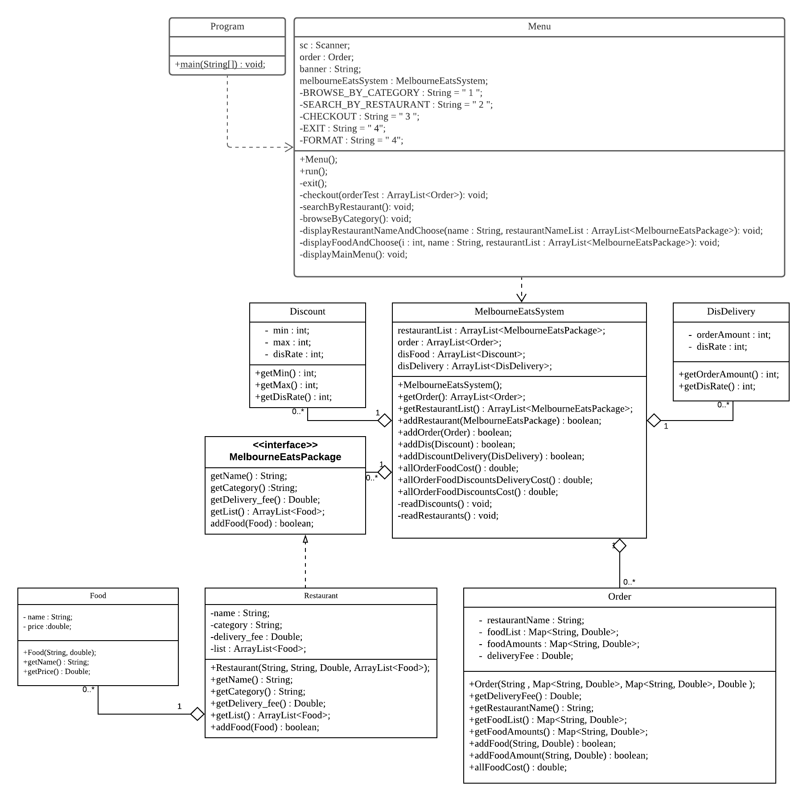

## FP-S3664976-A1 ##
This is the repo for FP for A1 in Semester 2, 2021
 
Pengcheng Lin s3664976
## Contents (updated) ##
**UML Diagrams & Design:**

## Navigating Folders: ##

"src/main/java" - code file

"src/main/java/main/Program.class" - Start run 

"src/main/java/main/Menu.class" - Front end print place

"src/main/java/melbourneEats/melbourneEatsSystem.class" - The back end. Where the data is stored

"src/test/java/rmit/edu/au" - The test place. 

If you need to run the code, click **program.class** first. In addition, you need a **Maven to open it**.

Please check whether the language is the latest version.

Remember to **use Maven to download dependencies** when running test files.

Finally, be sure to use **intellij** to use this code.